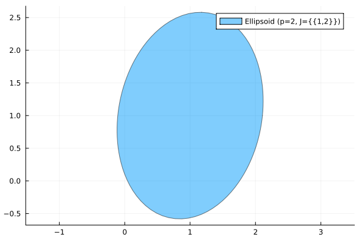

This project provides a foundational implementation of **Ellipsotopes**, a set representation designed to unify the advantages of ellipsoids and zonotopes for reachability analysis and fault detection.

### The Core of Ellipsotopes

In systems analysis, ellipsoids and zonotopes are common tools for representing sets of possible states. However, they both have significant limitations:
*   **Ellipsoids** are useful for representing smooth boundaries but can be overly conservative in calculations like the Minkowski sum, and they are not closed under intersection.
*   **Zonotopes** handle Minkowski sums exactly but, as polytopes, cannot represent sets with curved boundaries.

Ellipsotopes, as introduced in the paper "Ellipsotopes: Uniting Ellipsoids and Zonotopes for Reachability Analysis and Fault Detection" (arXiv:2108.01750v4), bridge this gap. An ellipsotope is a set representation that is closed under affine maps, Minkowski sums, and intersections, combining the strengths of both predecessors.

An ellipsotope is defined as the set:

*E<sub>p</sub>(c, G, A, b, I) = {c + Gβ | ||β(J)||<sub>p</sub> ≤ 1 ∀J ∈ I, Aβ = b}*

where:
*   `c` is the center vector.
*   `G` is the generator matrix.
*   `p` specifies the p-norm used in the constraints.
*   `I` is a partition of the generator indices, grouping them for norm constraints.
*   `A` and `b` define linear constraints on the generator coefficients `β`.

This structure is general enough to represent a zonotope (by setting `I = {{1}, {2}, ...}` ) or an ellipsoid (by setting `p=2` and `I = {{1, 2, ...}}`).

### Project Status: Implementation in `LazySets.jl`

This project is a core implementation of the ellipsotope concept in `LazySets.jl`. Below is a summary of the completed features and the work that remains to fully realize the potential of this set type.

#### Completed Features
*   **Core Datatype**: The `Ellipsotope` struct has been implemented, encapsulating the center (`c`), generators (`G`), p-norm (`p`), index set (`I`), and linear constraints (`A`, `b`).
*   **Constructors**: The implementation includes a basic constructor and convenience methods to convert existing `LazySets.Zonotope` and `LazySets.Ellipsoid` types into ellipsotopes.
*   **Basic Interface**: Core accessor functions such as `dim`, `center`, `genmat`, and `ngens` are available.
*   **Point Containment (`in` or `∈`)**: A function to check if a point `x` is contained within an ellipsotope is implemented. This is achieved by adding the constraint `Gβ = x - c` and solving a feasibility problem.
*   **Emptiness Check (`isempty`)**: The implementation can determine if an ellipsotope is an empty set by solving an optimization problem to find a feasible set of coefficients `β`. This relies on the `SCS.jl` solver.
*   **Support Function (`ρ`)**: The support function is implemented, which is a critical function for many set-based algorithms.
*   **2D Visualization**: A plotting recipe is included that uses a ray-tracing method to generate the boundary of a 2D ellipsotope, allowing for visual inspection.

#### Future Work
*   **Closed Set Operations**: The core strengths of ellipsotopes lie in their closure under certain operations. The following are not yet implemented:
    *   **Affine Maps**
    *   **Minkowski Sum**
    *   **Intersection** (with other ellipsotopes, hyperplanes, and half-spaces)
    *   **Cartesian Product**
*   **Full p-norm Support**: While the plotting function includes logic for general p-norms, the core feasibility checks (`isempty`) are currently optimized for the 2-norm, and broader support is needed.
*   **Benchmarking**: A comprehensive performance comparison against native `Zonotope` and `Ellipsoid` types is needed to quantify the trade-offs in accuracy and computation time.

### Initialization and Usage Example
The implemented code successfully initializes the `Ellipsotope` struct and can be used in the Julia environment as shown below.

```julia
julia> c1 = [1.0, 1.0]
2-element Vector{Float64}:
 1.0
 1.0

julia> G1 = [1.0 0.5; -0.5 1.5]
2×2 Matrix{Float64}:
  1.0  0.5
 -0.5  1.5

julia> E1 = Ellipsotope(c1, G1, 2.0)
Ellipsotope{Float64, Vector{Float64}, Matrix{Float64}, Float64, Vector{Vector{Int64}}}([1.0, 1.0], [1.0 0.5; -0.5 1.5], 2.0, [[1, 2]], Matrix{Float64}(undef, 0, 2), Float64[])
```

### Visualization Examples

The following are visualizations generated using the custom plotting recipe for the `Ellipsotope` type.

**1. Ellipsotope Representing an Ellipsoid (`p=2`, single index group)**


**2. Ellipsotope Representing a Zonotope (one index group per generator)**


**3. Comparison of Ellipsotope and Native Zonotope Representations**
